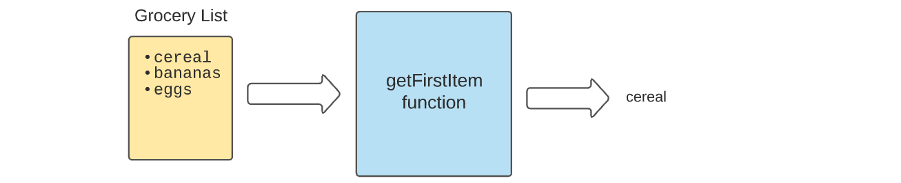

# Lesson objectives

_After this lesson students will be able to:_

* Define a function
* Understand function parameters and arguments
* Define a function with a return value
* Combine functions with conditionals and loops

---

# FUNCTIONS

<!-- ### REVIEW

Conditions let us control whether or not a piece of code will inside a block of code. `{...}`

```javascript
const isSunny = false;

if (isSunny) {
	console.log('Lay out in the grass');
}
```

Loops let us _repeat_ lines of code within a block `{ ... }` according to our instructions:

```javascript
const num = 0;

while (num < 5) {
	console.log('Are we there yet?');
	num++;
}
```

////////////////////////////////////////////////
////////////////////////////////////////////////

for (let i = 0; i < 5; i++) {
  console.log(i);
}

```js
const fruits = ['apple', 'banana', 'orange', 'pear'];

fruits[0];
fruits[1];
fruits[2];

for (let i = 0; i <= fruits.length; i++) {
	console.log(fruits[i]);
}

////////////////////////////////////////////////
////////////////////////////////////////////////

// - Write out Psuedocode with class
// See if fruit exists in our list of fruits
// Get a boolean true or false

// Loop through list of fruits
  // for each fruit
    // check if it equals the item we are looking for

const fruits = ['apple', 'banana', 'orange', 'pear'];
const itemToCheck = 'orange';

let hasItem = false;

for (let i = 0; i < fruits.length; i++) {
  if (fruits[i] === itemToCheck) {
    hasItem = true;
  }
}

console.log(hasItem);

////////////////////////////////////////////////
////////////////////////////////////////////////

Get first letter of each person's name

const students = [
  'Austin',
  'Amanda',
  'Fariba',
  'Alex',
  'Alex',
  'Dorothy',
  'Michelle',
  'Neha',
  'Elissa'
];

// What we want
const firstLetters = ['A','A','F','A','A','D','M','N','E'];

// Psuedocode
// - Loop through list of stuents
  // - For each student
    // - Get first letter

const firstLetters = [];

for (let i = 0; i < students.length; i++) {
  const student = students[i];
  const first = student[0];

  firstLetters.push(first);
}

console.log(firstLetters);

/////////////////////////////////////////////////

Find out who has the longest name

const students = [
  'Austin',
  'Amanda',
  'Fariba',
  'Alex',
  'Alex',
  'Dorothy',
  'Michelle',
  'Neha',
  'Elissa'
];

// Loop through the array
// Check the length of each person's name
// See if it is longer than the longest one we have seen so far

for (let i = 0; i < students.length; i++) {
  console.log(students[i])
}

let longestName = '';

for (let i = 0; i < students.length; i++) {
  const nameLength = students[i].length;

  if (nameLength > longestName.length) {
    longestName = stidents[i];
  }
}

console.log(longestName);

``` -->

## WHAT IS A FUNCTION?

Functions are a powerful construct in programming that allow us to organize our programs into chunks. We can think of a function like a black box that take in some input and returns an output.


<br>

<hr>

Say for example, we wanted a function that would tell us the first item on our grocery list. We could create a function that would take a grocery list as its input and return the first item on the list as its output.



<br>
<hr>

## DEFINING A FUNCTION

Let's start with the basic structure of a function.

To define a function we include the `function` keyword followed by the function name, a set of parentheses and then the body of the function.
```javascript
function func() {
  console.log('This will be called later');
}
```
This code by itself will not run. To run this code we can call or **invoke** the function like so.

```js
func();
```
To call the function simply include the name of the function followed by a set of openning and closing parentheses.

<br>
<hr>

### WHY FUNCTIONS?

Functions give the ability to organize our code into chunks and give those chunks names. This makes the code easier to understand and to reason about.

Functions allow us to store a line of code for later to be used as many times as we wish. This saves us from having to rewrite the same code many times. It follows the DRY principle (Don't Repeat Yourself).

<br>
<hr>

## CALLING A FUNCTION MANY TIMES

A function can be called many times and in this case will give us the same output every time.
```js
function logAlert() {
  console.log('Ah ah ah... you didn\'t say the magic word.');
}

logAlert();
logAlert();
logAlert();
logAlert();
logAlert();
```

<br>
<hr>

## PARAMETERS

Functions can take in information and then act on that information in the form of **parameters**.

In this case the `printGreeting` function takes in a name **parameter** and prints out a custom message with the name inserted.
```js
function printGreeting(name) {
  console.log(`Welcome ${name}`);
}

const firstName = 'Yash';

printGreeting(firstName);
```
When calling `printGreeting(firstName)` the value we pass to it is refered to as an **argument**. When defining the function the values pass in are refered to as **parameters**.

<br>
<hr>

## PASSING MULTIPLE PARAMETERS

We have the ability to pass many parameters to a function.

We've set up this function to take in 3 parameters and print out a longer greeting with the three values inserted.

```js
function printLongGreeting(name, numberOfMessages, dayOfWeek) {
  console.log(`Welcome ${name}. Today is ${dayOfWeek}. You have ${numberOfMessages} messages.`);
}

printLongGreeting('Sam', 12, 'Friday');
```

Often we will pass variables as the arguments to the function when we call it.
```js
const userName = 'Roberta';
const usersMessages = 30;
const currentDayOfWeek = 'Thursday';

printLongGreeting(userName, usersMessages, currentDayOfWeek);
```

<br>
<hr>

## EXERCISE

Write a function that will log out a person's order at a restuarant, that takes in three **parameters**, the person's name, a menu item, and their table number.

<details>
  <summary>Solution:</summary>

  ```js
  function printOrder(orderName, menuItem, tableNumber) {
    console.log(`${menuItem} for ${orderName} at table #${tableNumber}`);
  }
  ```
</details>

<br>
<hr>

## RETURNING A VALUE

A function can also return a value.
This function takes in 2 numbers and returns the sum of those numbers.
```js
function getTheSum(a, b) {
  return a + b;
}

const totalApples = 20;
const totalBananas = 10;

// Simply calling the function will not do anything in this case.
getTheSum(totalApples, totalBananas);

// Instead, that return value can be stored in a variable for later use, like so.
const sum = getTheSum(totalApples, totalBananas);

console.log(sum);
```

<br>
<hr>

## MORE PRACTICE WITH RETURN

This function takes in 3 pieces of information, the itemName, the price, and the mustGoByDate, and prints out a message using those 3 pieces of information.
```js
function returnAdMessage(itemName, price, mustGoByDate) {
  return `I am selling ${itemName} for ${price}. It must go by ${mustGoByDate}.`;
}

const item = 'Lamp';
const price = 50;
const date = 'tomorrow';

const message = returnAdMessage(item, price, date);

console.log(message);
```
The function returns a value. We can store this return value in a variable and then log out the variable.


This function takes in 3 pieces of information, breakfastItem, currentDayOfWeek and the rating and returns a message using those 3 pieces of information.

```js
function printBreakfast(breakfastItem, day, rating) {
  return `Today is ${day}. I ate ${breakfastItem}. I give a ${rating} out of 10`;
}

const todayBreakfast = 'Omelet';
const today = 'Monday';
const breakfastRating = 6;

const message = getMessage(todayBreakfast, today, breakfastRating);

console.log(message);
```

<br>
<hr>

## FUNCTIONS WITHOUT RETURN

If you leave out the `return` value in a function it will return `undefined`.

Take one of our earlier examples.

```js
function printGreeting(name) {
  console.log(`Welcome ${name}`);
}
```
Here we are logging out a value but we are not returning anything.

Let's try to store the return value in a variable and then log out that variable.

```js
const greeting = printGreeting('Sally');

console.log(greeting);
```

Under the hood our function actually looks like this.

```js
function printGreeting(name) {
  console.log(`Welcome ${name}`);
  return undefined;
}
```

<br>
<hr>

## RETURN EXITS THE FUNCTION

A return statement will exit the function, meaning nothing under the `return` statement will run.

Take for example our example that takes in a first name and a last name and returns the full name.
```js
function getFullName(firstName, lastName) {
  return `${firstName} ${lastName}`;

  console.log('After the return.');
}

const fullName = getFullName('Fran', 'Babbage');

console.log('After calling the function.');
```
We will never see the `After the return` in our console. The function will return a value and exit the function before it even gets to that line of code.

Create your own example and try this out for yourself.

<!-- // REVIEW ON FOR LOOPS

This will add up all the numbers from 0 to 9 and log out the total.

```js
let numbersSum = 0;

for (let i = 0; i < 10; i++) {
  numbersSum += i;
}

console.log(numbersSum);
``` -->

<br>
<hr>

## CONDITIONALS WITH FUNCTIONS

This function returns a message based on if the value passed in (hasFood) is true or false.

```js
const hasFoodInFridge = false;

function getFoodMessage(hasFood) {
  if (hasFood) {
    return 'You are good to go';
  } else {
    return 'Time to get some groceries';
  }
}

const foodMessage = getFoodMessage(hasFoodInFridge);

console.log(foodMessage);
```
Because the function returns a value, in order to get access to the value we store it in a variable with...
```js
const foodMessage = getFoodMessage(hasFoodInFridge);
```
After that we can log out the variable.

<br>
<hr>

## MORE CONDITIONALS WITH FUNCTIONS

This function will return a message based on if isAdmin and isLoggedIn is true.

```js
function getLoginMessage(isAdmin, isLoggedIn) {
  if (isLoggedIn && isAdmin) {
    return 'Welcome admin user.';

  } else if (isLoggedIn && !isAdmin) {
    return 'Welcome website user.';
    
  } else {
    return 'You are not logged in.';

  }
}

const loginMessage = getLoginMessage(false);
console.log(loginMessage);
```

Hopefully we are starting to see how we can use functions to our advantage here. We can think of functions like a black box that take in some input and return an output. When we call our function we need to know about all the details happening inside. When calling the function we are just concerned with the information we give it, the **parameters** and the value that is outputed, the **return value**.

<details>
  <summary>Here is the visual again</summary>

  
</details>

<br>
<hr>

## BREIF REVIEW ON FOR LOOPS

Here we loop through each student in the list and log them out.

```js
const students = [
  'Shawna',
  'Sam',
  'Sri',
  'Simone'
];

for (let i = 0; i < students.length; i++) {
  console.log(students[i]);
}
```

<br>
<hr>

## COMBINING LOOPS WITH FUNCTIONS

This function will loop through the list that is provided and if it finds an item that matches itemToCheck it will return true. If the itemToCheck is not found in the list, the function will return false.
```js
const groceryList = [
  'spanich',
  'beans',
  'eggs',
  'watermelon',
  'blueberries',
];

function listHasItem(list, itemToCheck) {
  for (let i = 0; i < list.length; i++) {
    if (list[i] === itemToCheck) {
      return true;
    }
  }

  return false;
}

const hasItem = listHasItem(groceryList, 'soup');

console.log(hasItem);
```

This function will loop through a list and return a formatted version of the list turned into a string.

```js
function getGroceryList(list) {
  let stringResult = '';

  for (let i = 0; i < list.length; i++) {
    stringResult += `${i + 1}. ${list[i]}\n`;
  }

  return stringResult;
}

const coolGroceryList = getGroceryList(groceryList);

console.log(coolGroceryList);
```

<br>
<hr>

## FUNCTIONS AND ARRAYS

We learned that arrays are a very handy way of storing related data. Let's take a look at combining them with functions.

### ACTIVITY 1

Write a function that takes in an array of grocery items as a **parameter** and returns just the first item in that list.

<details>
  <summary>Solution: </summary>

  ```js
  function getFirstItem(groceryList) {
    return groceryList[0];
  }

  const myList = ['spinach', 'tomato sauce', 'pickles'];

  const firstItem = getFirstItem(myList);

  console.log(firstItem);
  ```
</details>

### ACTIVITY 2

This time write a function that will take in an array of grocery items and return the array with the first item removed.

For example, our function should take this as a **parameter**
```js
const myList = ['spinach', 'tomato sauce', 'pickles'];
```
and return this.
```js
['tomato sauce', 'pickles'];
```

Do some research to see how you can remove the first item from an array.

Hint: Google `javascript remove first item from array`.

<details>
  <summary>Solution:</summary>

  Eventually you may come across the [shift](https://developer.mozilla.org/en-US/docs/Web/JavaScript/Reference/Global_Objects/Array/shift) method with JavaScript.

  Read the [documentation](https://developer.mozilla.org/en-US/docs/Web/JavaScript/Reference/Global_Objects/Array/shift) take a moment to see if you can understand how it's working.

  ```js
  function removeFirstItem(groceryList) {
    groceryList.shift();

    return groceryList;
  }

  const myList = ['spinach', 'tomato sauce', 'pickles'];

  const updatedList = removeFirstItem(myList);

  console.log(updatedList);
  ```
</details>

### ACTIVITY 3

Write a function that takes an array of grocery items as its first **parameter** and a grocery item as its second **parameter**. This function should return true or false indicating whether or not the array includes the item.

Calling the function would look like this.

```js
const hasItem = doesListHaveItem(myGroceryList, item);
```

Do some research to see how to check if an array includes an item.

Hint: Google `javascript check if array has a particular item`.

<details>
  <summary>Solution:</summary>

  After googling you might eventually come across the [`.includes`](https://developer.mozilla.org/en-US/docs/Web/JavaScript/Reference/Global_Objects/Array/includes) method with JavaScript.

  Read the [documentation](https://developer.mozilla.org/en-US/docs/Web/JavaScript/Reference/Global_Objects/Array/includes) take a moment to see if you can understand how it's working.

  ```js
  function doesListHaveItem(groceryList, itemToCheck) {
    return groceryList.includes(itemToCheck);
  }

  const myList = ['spinach', 'tomato sauce', 'pickles'];

  const hasItem = doesListHaveItem(myList, 'cookies');

  console.log(hasItem);
  ```
</details>

<br>
<hr>

## FUNCTION EXPRESSIONS

A function expression is another way to define a function. Here we define a function without a name and store it in a variable.

```js
const newFunction = function() {
  console.log('newFunction was called!');
}

newFunction();
```
Defining a function without a name, as we do on the right hand side of the equal sign is referred to as defining an anonymous function.

<br>
<hr>

## ARROW FUNCTIONS

A newer version of JavaScript (ES6 / ES2015) allows us to write a function with the following syntax.

```js
const anotherFunction = (name) => {
  console.log(`Hey ${name}, anotherFunction was called!`);
}

anotherFunction('Lenny'); 
```

# EXTRA STUFF TO TRY OUT

## String and array methods

A method can be chained to a variable to perform an action. Example:

```javascript
const message = "hello there";

console.log(message.toUpperCase());
```

> => "HELLO THERE"

`.toUpperCase()` is a **method**.

<br>


## Datatypes

There are different methods for different **datatypes**.

Strings have different methods than arrays. In general, you can't use array methods on strings and vice versa.

Example of an **array** method:

```javascript
const letters = ['A', 'B', 'C', 'D'];

console.log(letters.join(''));
```

> => ABCD

`.join()` is a **method**, but it is only for arrays.


It will not work on a string:

```javascript
const letters = "ABCD";

console.log(letters.join(''));
```


> Here, `letters.join` is not a function because `.join` is not a method you can use on strings. See: TypeError


**.length is a method you can use on both strings and arrays**

<br>

## Methods can change the datatype

If we use `.join('')` on an array as intended:

```javascript
const letters = ['A', 'B', 'C', 'D'];

console.log(letters.join(''));
```

It will however output a **string**. Be mindful of this when it comes to **chaining methods**.

For example `.reverse()` is an **array** method.

```
console.log(letters.join.reverse());
```


It will not work because the result of `letters.join('')` is a string.

<br>

## Chaining built-in methods

You can chain methods together:

```javascript
const str = "doodly doo";

console.log(str.split('').length);
```

> => 10

**Be mindful of datatypes**

This will not work:

```javascript
const str = "doodly doo";

console.log(str.split('').toUpperCase);
```


&#x1F535; **Why Not?**

Notice the error says `TypeError`. This is a big indicator as to what the problem is.

We are trying to use `.toUpperCase()` on the wrong type of data. In this case, we are trying to use it on an array, when it is not an array method. It is a string method.

&#x1F535; **Activity**

RESEARCH

How can you reverse a string?

* Try to use `.reverse()` on a **string**. Does it work?

* If it does not work, what is the error telling you?

* Try to use `.reverse()` on an array instead. Does it work?

There is no `.reverse()` method for strings, but there _is_ one for arrays.


&#x1F535; **Activity**

Using method chaining, figure out how to turn a string into an array, reverse the array, and turn the reversed array back into a string. This is one way to reverse a string. Chain the methods together on one line.

[Some string methods](https://www.w3schools.com/js/js_string_methods.asp)

[Some array methods](https://www.w3schools.com/js/js_array_methods.asp)

<br>

&#x1F535; **Extra**

Look into `regular expressions` and the [.match()](https://www.w3schools.com/jsref/jsref_match.asp) method. Use `.match()` only to select parts of a reversed string that match a pattern.

&#x1F535; **Extra**

Start in on this [regular expressions](https://regexone.com/) exercise.

<br>
<hr>

